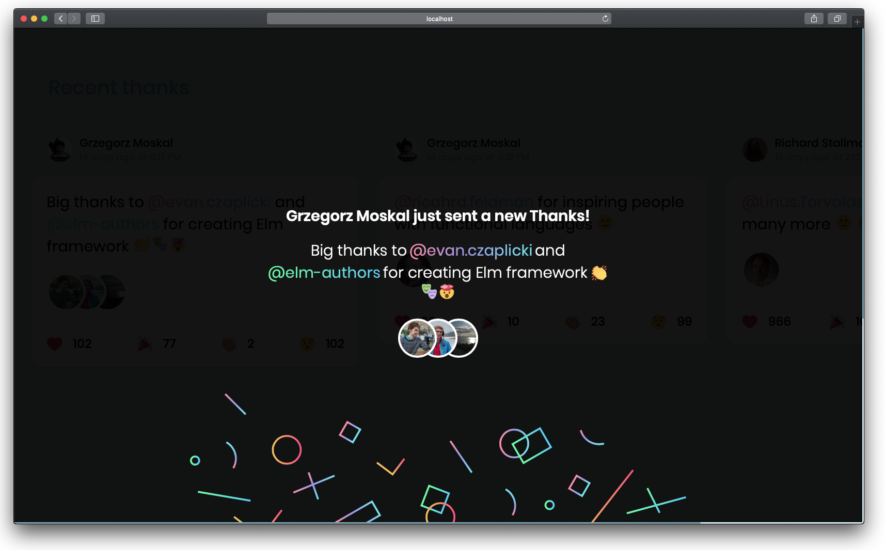

# Elm version of thanksy project - [Work in progress]

[](http://elm-lang.org)

For more details (and the bigger picture) you can visit our [landing page](https://tooploox.github.io/thanksy/) and check out our [backend repository](https://github.com/tooploox/thanksy-server).

Nevertheless, this is a [thanksy client](https://tooploox.github.io/thanksy/) written in `Elm`. It was created as an experiment, to check how difficult is to rewrite `typescript` project (with `react`/`redux`/`redux-loop` ) into the Elm framework.

On the one hand, [Redux](https://redux.js.org/introduction/prior-art#elm) and [Redux loop](https://redux-loop.js.org/) have been highly inspired by the Elm Architecture. On the other hand, we love React's `Functional components` and algebraic data types implemented in Typescript. All that made that rewriting process pretty easy. Text parsing algorithm that splits texts into an array of chunks was taken from the [original project](https://github.com/tooploox/thanksy-client-ts) and `ports` were used to communicate with the Elm world.

The experiment was successful and we have `two thanksy clients` with the same set of functionalities.



## Setup

Install npm packages:

```bash
npm install
```

Start a local dev server

```bash
npm start
```

Load http://localhost:8080/

-- OR --

Bundle files for production:

```bash
npm run build # it transpiles all your Elm and ts into dist/index.bundle.js
```
